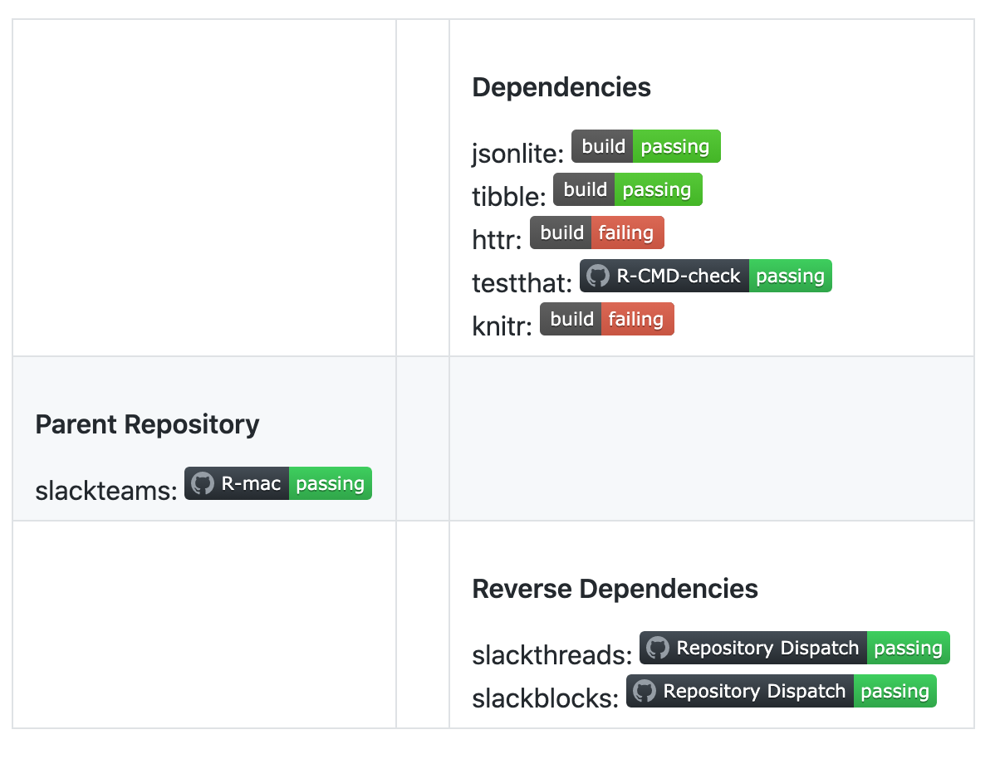

```{r setup, include=FALSE}
options(htmltools.dir.version = FALSE)
```

```{r xaringan-themer, include=FALSE, warning=FALSE}
library(xaringanthemer)
style_duo_accent(
  primary_color = "#1381B0",
  secondary_color = "#FF961C",
  inverse_header_color = "#FFFFFF",
  table_row_even_background_color = "#FFFFFF"
)
```

```{r xaringan-panelset, echo=FALSE}
xaringanExtra::use_panelset()
```

```{r,echo=FALSE}
print_yml <- function(path){
  knitr::asis_output(sprintf("```yml\n%s\n```",paste0(readLines(path),collapse = '\n')))
}
```

# What are GitHub Actions?

- Integrated GitHub CI/CD
  - Same idea as Travis, Appveyor, Jenkins, Drone, ...
  
- Build, test, and deploy your code right from GitHub. 

- Make code reviews, branch management, and issue triaging work the way you want.

---

# Where do GitHub Actions Live?

```yml
.
├── .Rbuildignore
├── .Rproj.user
├── .git
├── .github
│   └── workflows
│       └── R-CMD-check.yaml
├── .gitignore
├── DESCRIPTION
├── LICENSE
├── NAMESPACE
├── R
├── README.md
├── _pkgdown.yml
├── codecov.yml
├── gha_r_tutorial.Rproj
├── inst
├── man
├── tests
└── vignettes
```

---

# Intializing .github

- Manually

```r
dir.create('.github/workflows',recursive = TRUE)
file.create('.github/workflows/R-CMD-check.yaml')
```

- {usethis}

```r
usethis::use_github_actions()
✓ Setting active project to '/Users/yonis/projects/gha_r_tutorial'
✓ Creating '.github/'
✓ Adding '^\\.github$' to '.Rbuildignore'
✓ Adding '*.html' to '.github/.gitignore'
✓ Creating '.github/workflows/'
✓ Writing '.github/workflows/R-CMD-check.yaml'
```
---

# Basic Structure of the yaml

.panelset[
.panel[.panel-name[On]

Workflows can be triggered when code is pushed to any branch in a repository

```yml
on: push
```

This is an example of an workflow triggered on push or pull request events

```yml
on: [push, pull_request]
```

This is a more realistic example that a workflow is triggered only on push or pull events on the master or main branches.

```yml
on:
  push:
    branches: [main, master]
  pull_request:
    branches: [main, master]
```

]
.panel[.panel-name[Name]
This is as it seems, the name of the workflow that will be used a label in the IDE

```yml
name: R-CMD-check
```

]
.panel[.panel-name[Job]
These are the commands you want the machine to run

```{r,echo = FALSE}
print_yml('resources/snippets/r-cmd-check-job.yml')
```

]
]

---

### Putting It All Together

```{r,echo=FALSE}
print_yml('resources/snippets/r-cmd-check.yml')
```

---

# Strategies

Constructing a strategy will allow to run multiple workflows from the same configuration file.

This lets you replace hardcoded values with values from an array.

```{r,results='asis',echo = FALSE}
print_yml('resources/snippets/matrix.yml')
```

---

# Environment Variables
.panelset[
.panel[.panel-name[Github]
It is strongly recommend that actions use environment variables to access the filesystem rather than using hardcoded file paths. GitHub sets environment variables for actions to use in all runner environments.

To find a full list of them go to [here](https://docs.github.com/en/free-pro-team@latest/actions/reference/environment-variables#default-environment-variables).

The main rule of thumb is that they are prefixed by `GITHUB_*`, and any user generated environment variables cannot have the same prefix.
]
.panel[.panel-name[User Defined]
User defined environment variables that the workflow has access to is done via the GitHub repository secrets.


]
.panel[.panel-name[Usage]
```{r,echo=FALSE}
print_yml('resources/snippets/environment.yml')
```

]
]

---
# Commit Message Interaction

It is possible to interact with the action based on the commit message

Here we can tell the workflow to skip (like [skip travis]) when the message contains 'skip winos'.

This can be helpful when there are multiple workflow being triggered on the same action, and you want to control which platform should actually be run. 

```{r,echo=FALSE}
print_yml('resources/snippets/commit_messages.yml')

```

---

# Common Workflows

Here is a list of [common R workflows](https://github.com/r-lib/actions/tree/master/examples#standard-ci-workflow) curated by Jim Hester and RStudio

- [CRAN submission](https://github.com/r-lib/actions/tree/master/examples#standard-ci-workflow)
- [Test coverage](https://github.com/r-lib/actions/tree/master/examples#test-coverage-workflow)
- [Render Readme](https://github.com/r-lib/actions/tree/master/examples#render-readme)
- [Deploy pkgdown](https://github.com/r-lib/actions/tree/master/examples#build-pkgdown-site)
- [Build Bookdown](https://github.com/r-lib/actions/tree/master/examples#build-bookdown-site)
- [Build Blogdown](https://github.com/r-lib/actions/tree/master/examples#build-blogdown-site)

---

# Tricky Tasks
.panelset[
.panel[.panel-name[magick]
.pull-left[
linux
```{r,echo=FALSE}
print_yml('resources/snippets/magick_linux.yml')
```
]

.pull-right[
osx
```{r,echo=FALSE}
print_yml('resources/snippets/magick_osx.yml')
```
]
]
.panel[.panel-name[tinytex]
.pull-left[
linux
```{r,echo=FALSE}
print_yml('resources/snippets/tinytex_linux.yml')
```
]
.pull-right[
winOS
```{r,echo=FALSE}
print_yml('resources/snippets/tinytex_winos.yml')
```
]
]
.panel[.panel-name[Interacting Via API]
```{r,echo=FALSE}
print_yml('resources/snippets/gh_api.yml')
```
]
.panel[.panel-name[covrpage]
```{r,echo=FALSE}
print_yml('resources/snippets/covrpage.yml')
```
]
]

---
# Weak Points

GitHub actions do have a few weak points that you should know that is different from other CI/CD systems.

- Invoking a workflow only via commit (can't via GUI)
- Cron jobs only work on main branch
- You can't blow away your cache (bump the version of the restore-keys) 

```{r,echo=FALSE}
print_yml('resources/snippets/cache.yml')
```

---
# Leveling Up

### GitHub Marketplace

The GitHub actions marketplace is where fellow GHA users post their self contained tasks that can be reused by any user (think CRAN but for GHA)

Here is the link to it: https://github.com/marketplace?type=actions

We will touch on a few useful ones I have used

  - [Debugging with tmate](https://github.com/marketplace/actions/debugging-with-tmate): SSH into an active workflow for advanced debugging

  - [Repository Dispatch](https://github.com/marketplace/actions/repository-dispatch): A repository dispatch event lets you create your own events to trigger builds in other repositories.
  
  - [github-push-action](https://github.com/marketplace/actions/repository-dispatch): Push to another branch in the repository


---

### Debugging with tmate
.pull-left[
```{r,echo=FALSE}
print_yml('resources/snippets/tmate.yml')
```
]

.pull-right[

]

---

### Deploying to Another Branch

```{r,echo=FALSE}
print_yml('resources/snippets/deploy.yml')
```

---
### Repository Dispatch

Using Repository Dispatch we can start to connect GitHub Repository action workflows
.pull-left[
[Parent Workflow](https://github.com/yonicd/slackteams/blob/master/.github/workflows/R-mac.yml#L75)

```{r,echo=FALSE}
print_yml('resources/snippets/dispatch_parent.yml')
```
]

.pull-right[
[Child Workflow](https://github.com/yonicd/slackthreads/blob/master/.github/workflows/R-mac-revdep.yml)

```yml
name: Repository Dispatch

on:
  repository_dispatch:
    types: [push]
```
]

---
### Clapping Back

If the child workflow fails it will use the information it got from the parent to open an issue referencing the offending github commit hash.

```{r,echo=FALSE}
print_yml('resources/snippets/clapback.yml')
```

---
### Revdep Workflow

Combining Repository Dispatch with Clapping Back you can create a Revdep workflow. For an example workflow you can see in [yonicd/slackteams](https://github.com/yonicd/slackteams/blob/master/.github/workflows/R-mac-revdep.yml).

Adding a line to install the hash for the parent repository before all the other package dependencies are installed will test the package against the current dependency build and the other CRAN installations.

If it fails then clapback is invoked to let the developer know something is wrong.

```{r,echo=FALSE}
print_yml('resources/snippets/revdep.yml')
```

---
# Slackverse

The packages in slackverse are all connected in a CI/CD network where if one of them fails a then it will trigger warnings across the whole network of packages.

||||
|:----:|:----:|:----:|
|| slackcalls<br>[](https://github.com/yonicd/slackcalls) ||
| slackthreads<br>[](https://github.com/yonicd/slackthreads) |slackteams<br>[](https://github.com/yonicd/slackteams) |  slackposts<br>[](https://github.com/yonicd/slackposts)|
||| slackblocks<br>[](https://github.com/yonicd/slackblocks) |
||| slackreprex<br>[](https://github.com/yonicd/slackreprex) |

---

# Development: {Shield}

.panelset[
.panel[.panel-name[Goal]
The goal of [shield](https://github.com/yonicd/shield) is to create a simple workflow to install package first level dependencies exclusively from github remote repositories when available.

- {shield} will query the DESCRIPTION file and locate all the remote locations of the package dependencies.
- This is meant to be used in a CI/CD where in the workflow the remote dependencies are found and installed instead of the current CRAN install.
- This can create a much earlier warning system than CRAN checks that let you know if there is trouble ahead based on development repos of your dependencies and react accordingly.
- This is similar to the idea of [synk](https://snyk.io/) for npm packages.
]
.panel[.panel-name[Workflow]
.center[]
]
.panel[.panel-name[Usage]
```r
Package: shield
Type: Package
Title: Full Remote Installation
Version: 0.0.1
Depends: R (>= 3.6.0)
Imports: httr,base64enc,desc,remotes,utils,stats
Suggests: knitr,rmarkdown
```

```r
create_map('DESCRIPTION')
#>             package                                      sha    type
#> 1        r-lib/httr 844c8c75e25eaf1e385810b6ede4aa56b70493f8 remotes
#> 3        r-lib/desc 61205f60616a90d2a9fba8241c81870ac27f3d5c remotes
#> 4     r-lib/remotes 8d8d545cb6a1725bd943522cb953c5c2755c2cf4 remotes
#> 5       yihui/knitr ab191b07223a609e7c4ba53d664d35ebfc9dcb97 remotes
#> 6 rstudio/rmarkdown 18ba267c6a0b9789c680a5b6135db910dd937e47 remotes
#> 2         base64enc                                     <NA>    cran
```

]
.panel[.panel-name[GHA]

```{r,echo=FALSE}
print_yml('resources/snippets/shield.yml')
```
]

.panel[.panel-name[Visualization]
Respository Dispatch status are invoked only after the parent repository passes a successful master branch build.

.center[]
]]

---

class: center, middle

# Thank you!
